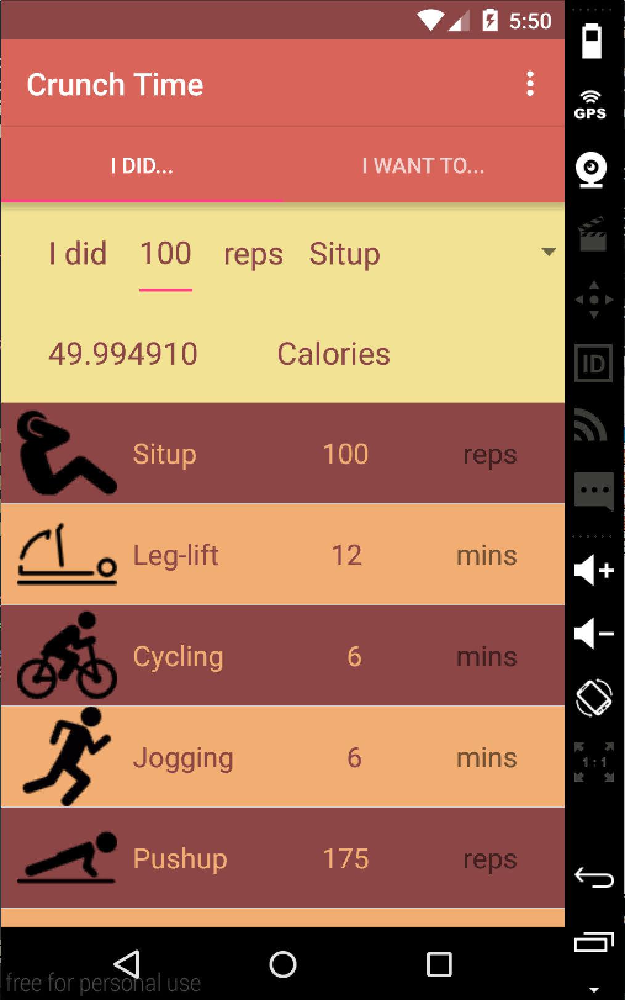
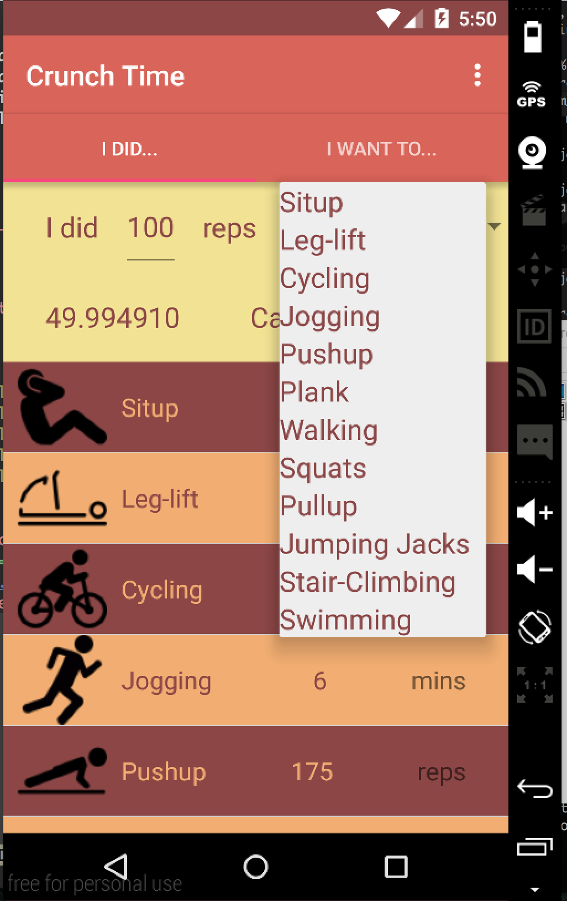
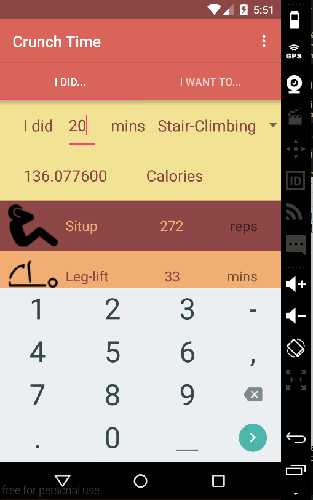
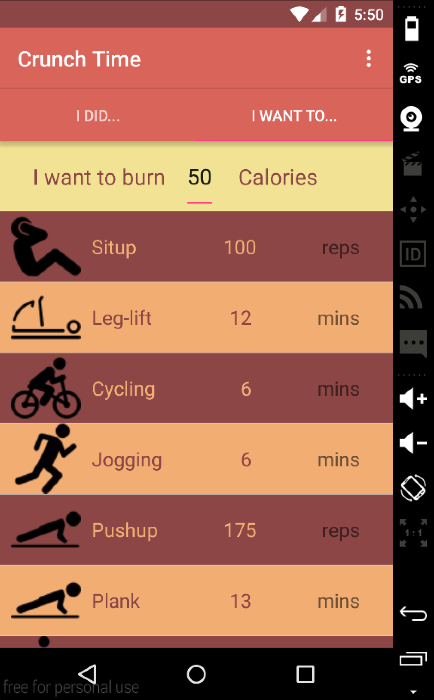
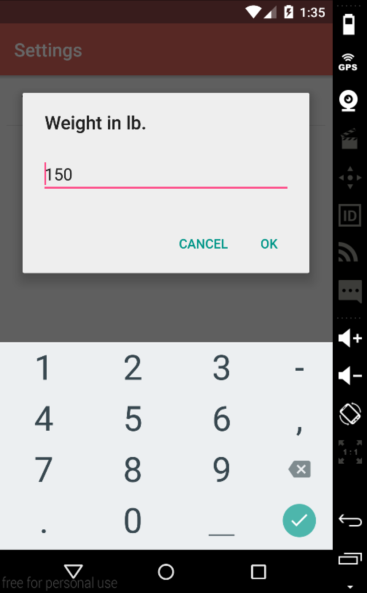

# PROG 01: Crunch Time

This Application is a simple implementation of a personal training application. It allows the
users to enter the amount of activities they did, and it quickly converts it to calories
and the amount of other activities takes to achieve the same calories. It also takes into
account of the user's weight. Moreover, it enable the user to enter a calorie count and 
displays how many of each activity they have to do in order to achieve such calorie count.

## Authors

Haojun Li ([haojun.li@berkeley.edu](mailto:your_email@berkeley.edu))

## Demo Video

See [your demo video title here] (https://link_to_your_video)

## Screenshots

## Acknowledgments

Icons made by <a href="http://www.freepik.com" title="Freepik">Freepik</a>, <a href="http://www.flaticon.com/authors/scott-de-jonge" title="Scott de Jonge">Scott de Jonge</a> from <a href="http://www.flaticon.com" title="Flaticon">www.flaticon.com</a> is licensed by <a href="http://creativecommons.org/licenses/by/3.0/" title="Creative Commons BY 3.0">CC BY 3.0</a>

